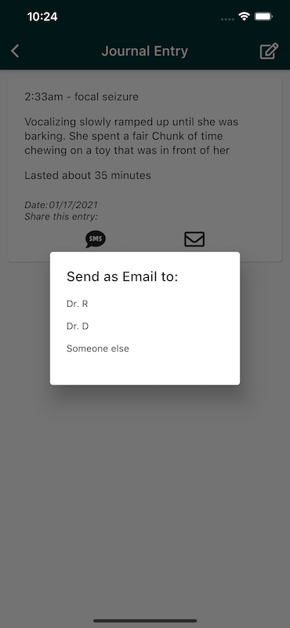

SimpleDialogs are an insanely simple way to display immediately actionable items while conforming to the Material Design specification. They're recommended for use when you need a flexible dialog that doesn't leverage text buttons. Take a moment to familiarize yourself with the [Material Spec for SimpleDialogs](https://material.io/components/dialogs#simple-dialog) and once you're back on this tab, we'll dive into their implementation specifically for Flutter.

## SimpleDialogs in Flutter

Alright! Welcome back! SimpleDialogs in Flutter are actually really straightforward to use. You can create one just like you would any other Widget:

```dart
SimpleDialog(
    title: Text("My Simple Dialog"),
    children: [
        SimpleDialogOption(
            onPressed: () {
                // do something when this option is pressed
            },
            child: Text("Tap here!"),
        );
    ],
);
```

Dialogs do have a slightly unique behavior when compared to other components. To actually show a Dialog, returning it in the component try is not enough. Instead, you must pass the Dialog to `showDialog` like so:

```dart
showDialog(context: context, builder: (BuildContext context) {
    return SimpleDialog(
        title: Text("My Simple Dialog"),
        children: [
            SimpleDialogOption(
                onPressed: () {
                    // do something when this option is pressed
                },
                child: Text("Tap here!"),
            )
        ],
    );
});
```

Lets take a moment to look at the return type for showDialog, shall we? [If we check out the documentation](https://api.flutter.dev/flutter/material/showDialog.html), we'll see that `showDialog` actually returns a Future of type `Future<T>`. This means that we can `await` a showDialog call to run code after the Dialog has been closed. Type `T` in this case, refers to the data type that can be returned from a Dialog.

Let's build a new Dialog that shows how this fits together:
```dart
var response = await showDialog(context: context, builder: (BuildContext context) {
    return SimpleDialog(
        title: Text("Pick Someone"),
        children: [
            SimpleDialogOption(
                onPressed: () {
                    Navigator.pop(context, "Brad")
                },
                child: Text("Brad"),
            ),
            SimpleDialogOption(
                onPressed: () {
                    Navigator.pop(context, "Catherine")
                },
                child: Text("Catherine"),
            ),
        ],
    );
});

print(response);
```

In this example, we show a Dialog with the title "Pick Someone" and two options, one for "Brad" and one for "Catherine." If the user taps one of those, the Dialog goes away and the name of person selected is stored in `response` which is ultimately printed to the console. The way this data comes back from `showDialog` is through the `Navigator.pop` call. Additionally, Dialogs can be dismissed by tapping outside of the dialog. In this case, as the `Navigator.pop` is never executed, `response` would be `null`.

## Making the SimpleDialog body reusable

Now that we understand how the SimpleDialog works, we can take the steps to make a dialog with a reusable body. Let's set the stage. I'm working on a Flutter app that helps users log information about their pets and then share that information with any of the veternarians that they have listed on their account. This often leads to a _lot_ of SMS and Email icons that, when tapped by the user, ultimately leads to showing them their veternarians and prompting them to pick one. So let's break down the project.



1. When the user is in the app and wants to share something, tapping on an SMS icon or an Email icon should show the user a dialog that asks them to choose who to share the data with.
2. If the user is tapping SMS and they don't have a phone number listed for any given vet, omit them from the list. The same should be true for emails. 
3. As a developer, this should be reusable so I don't have to maintain a bunch of different dialogs.

With these requirements in mind, let's break down the architecture for this project.

1. The content of this dialog is actually somewhat complicated. We'll be pulling data from ViewModels, so we want to encapsulate sourcing this data and rendering it in a component.
2. We want to make the component configurable so that it can filter out Veternarians that dont have an email address when email is selected and vice versa for phone numbers.

Let's start by defining how this component will interface with the rest of the "showDialog" flow.

```dart
GestureDetector(
    child: Icon(
        getIconUsingPrefix(name: "FA.envelope"),
        semanticLabel: "Email",
        size: 30),
    onTap: () async {
        var contact = await showDialog<SelectContactReturnType>(context: context, builder: (BuildContext context) {
        return SimpleDialog(
            title: Text("Send as Email to:"),
            children: [
                SelectContactDialogBody()
            ]);
        });
    // do something with contact
}),
```

This gives us an extremely simple interface that should be rather reusable throughout the rest of our codebase. Our dialog doesnt choose what to do with the selected data, merely it returns it to it's calling component instead. In some cases, we may want to launch a `mailto:` or `sms:`, but this allows us to grow our uses cases without adding too much specific logic to our "Contact Picker" or "Contact Selector".

So, what does the code for this look like? Let's define our two new types `SelectContactReturnType` and `SelectContactDialogBody`. Arguably, we could come up with better names for these, but please bear with me!

```dart
import 'package:cloud_firestore/cloud_firestore.dart';
import 'package:flutter/material.dart';
import 'package:luna_journal/models/veterinarian.dart';
import 'package:luna_journal/viewmodels/veterinarians_vm.dart';
import 'package:provider/provider.dart';


/// SelectContactConfiguration is used to determine which contacts should be shown.
/// For example, if SelectContactConfiguration.SMS is chosen, we will only show contacts
/// that has an SMS number associated with them.
enum SelectContactConfiguration {
  SMS,
  EMAIL
}


/// This is kind of a weird type.
/// By boxing the Veterinarian, we add a third type that can help us determine
/// if the dialog was terminated early, or if an actual option was selected.
/// If we have a selectContactReturnType, then we can check the vet. If a vet is
/// provided, then one was selected. If vet is null, "Someone else" was selected.
/// Finally, if the selectContactReturnType is null, then the user terminated the
/// dialog choice.
class SelectContactReturnType {
  final Veterinarian vet;

  SelectContactReturnType({this.vet});
}

/// SelectContactDialogBody is the BODY of a simple dialog.
class SelectContactDialogBody extends StatelessWidget {
  final SelectContactConfiguration configuration;

  SelectContactDialogBody({this.configuration});

  @override
  Widget build(BuildContext context) {
    // Leverage Provider to get the veterinarian view model.
    var vetVm = Provider.of<VeterinariansViewModel>(context);

    return StreamBuilder(
        stream: vetVm.getVeterinariansStream(),
        builder: (BuildContext context, AsyncSnapshot<QuerySnapshot> snapshot) {
          // Probably want to handle this differently in production
          if (snapshot.hasError) {
            return new Text('Error: ${snapshot.error}');
          }
          switch (snapshot.connectionState) {
            case ConnectionState.waiting:
              return Center(
                child: CircularProgressIndicator(),
              );
            default:
              var entries = snapshot.data.docs
                  .map((e) =>
                  Veterinarian().fromFirebaseSnapshotDocument(e))
                  .toList();

              // Here we check the configuration to determine which elements to show
              // we filter out the ones that dont have the configuration-specified field.
              if (configuration == SelectContactConfiguration.EMAIL) {
                entries = entries.where((element) => element.email != "" && element.email != null).toList();
              } else {
                entries = entries.where((element) => element.phone != "" && element.phone != null).toList();
              }

              if (entries.isEmpty) {
                // empty container is fine here because we'll render the generic contact option below
                return Container();
              }

              return SizedBox(
                // This is kind of hacky, but just know that
                // you might have to specify a width and a height
                // especially if your listBuilder is contained inside
                // another scrollable view
                height: (entries.length * 40.0) + 40,
                width: 200,
                child: ListView.builder(
                    scrollDirection: Axis.vertical,
                    itemCount: entries.length + 1,
                    itemBuilder: (BuildContext context, int index) {
                      return SimpleDialogOption(
                        onPressed: () {
                          var response = SelectContactReturnType(vet: index < entries.length ? entries[index] : null);
                          Navigator.pop(context, response);
                        },
                        child: Text(index < entries.length ? entries[index].name : "Someone else"),
                      );
                    }),
              );
          }
        });
  }
}
```

Wow, thats quite a lot of code! Hopefully this can help you see how this fits into a full, real-world example. With this level of abstraction, we can add this `SelectContactDialogBody` to any dialog and easily allow the user to choose a contact for us to work with in later code.

