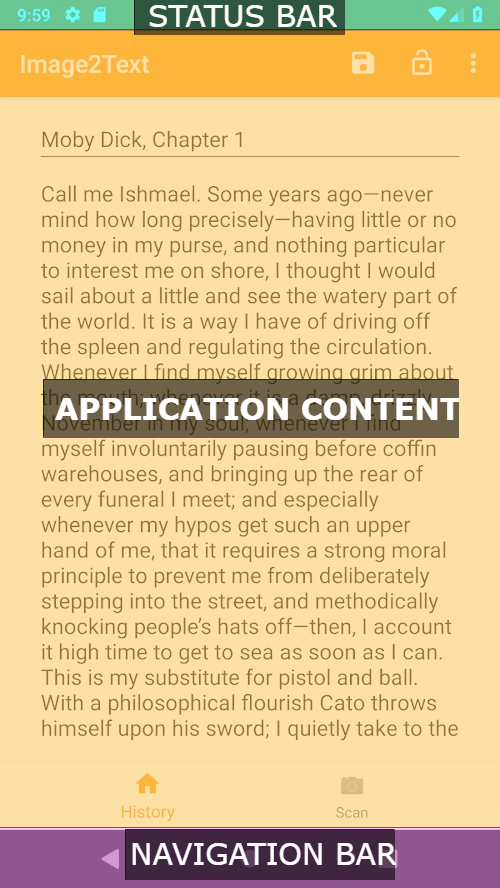

import HeadsUp from "../components/headsup";

Android’s SurfaceFlinger is a system service provided on the Android Operating System. Now that **that** is out of the way… What does it actually do? If you’ve worked with scrolling, you’ll know that “flinging” is an action that a user can do, but it’s not related to that. Actually, the SurfaceFlinger is a service that plays a critical part in determining what is rendered on the screen on any Android device.

It’s important to note that the SurfaceFlinger doesn’t directly render anything to the screen. In fact, all it does is merely composite buffers of data before handing them off to the HAL. In layman’s terms — The SurfaceFlinger takes in buffers of display data, composites them into a single buffer, and then passes that on to the hardware abstraction layer.

<HeadsUp title="Whats a HAL?">
  The HAL is an acronym for the Hardware Abstraction Layer. This layer bridges
  the gap between the software that runs on Android and the actual hardware
  responsible for running the operating system. This layer allows Android to
  effectively run on thousands of different devices!
</HeadsUp>

## What is a Buffer?

A buffer is simply a region of memory allocated for storing something temporarily while it’s moved to another place. However, the SurfaceFlinger works specifically with buffers that contain graphics and display data. It’s the same idea as the regular buffers that I just mentioned, except that all the data contained in them is used to inform something how the screen should be displayed.

## Where does the SurfaceFlinger get it's buffers?

In most Android applications, the SurfaceFlinger has access to three different buffers. A buffer for the Status Bar, a buffer for the Navigation Bar, and a Buffer for the application content. You can see each of these regions in the diagram below.

   

The above image shows three different sections of our Android device’s screen, each
powered by their own buffer! If you’ve built apps before, you’ll know that we cant
completely control the status bar or the navigation bar, so we can assume that these
buffers are provided by the operating system. However, the Application Content section
is created by us but we don’t have to new up a Buffer Object or anything like that
to render content to the screen! This is all taken care of for us, by the Operating
System.

## How many Buffers?

In a vast majority of applications, you (and consequently the SurfaceFlinger) will only deal with three buffers. However, it’s possible that you will actually have more than three buffers. It’s even possible that you’ll have fewer than three buffers as well!

We know that we can hide the status bar by setting the appropriate WindowManager flags (or using a theme that omits the status bar). In this example, we’d only have two buffers.

Consequentially, we can have 4 or more buffers by including a SurfaceView in our application. Each SurfaceView will have it’s own buffer that is composited by the SurfaceFlinger and not your application!

## How does the SurfaceFlinger work?

When an app is summoned to the foreground, the WindowManager system-service asks the SurfaceFlinger system-service for a surface. The SurfaceFlinger then creates a new layer and a Binder object. The Binder is then returned to the WindowManager (and consequentially to the application) which can then start sending frames to SurfaceFlinger.

## How does this all fit together?

A great question! Fortunately Google has built a fantastic diagram that shows the flow of data from inception to render.

In the above image, you can see that many different components can create buffer
data. The buffer data makes its way to the SurfaceFlinger (or an OpenGL ES App, but that’s another topic entirely)
and ultimately to the HAL so that it can be rendered to the screen.

## Handling Refresh Rate and VSYNC

Most Android Devices (phones and tablets) have a 60FPS (or 60 frames per second) refresh rate. If we were to refresh our screen while processing buffer data, the results could be uncomfortable. Often times, this display phenomena appears as tearing. To avoid this, it’s imperative that the SurfaceFlinger only updates contents between refreshes. This is accomplished by the system sending a VSYNC signal (or a vertical-sync signal). This signal is used to to help the operating system (and your application) sync up with the rate of the display hardware.

With these things in mind, it would be odd to assume that the surface flinger just draws whenever there is buffer data available. While it may looks this way, because our eyes have trouble seeing this fast, the SurfaceFlinger actually sleeps until the VSYNC signal arrives. When that signal does arrive, the SurfaceFlinger wakes up and walks through each list of layers, looking for new buffers. If it finds a new buffer, it’ll toss the reference to the old one and use the new buffer instead, otherwise it’ll hold onto the old buffer.

Finally, the SurfaceFlinger then reaches out to the HAL to ask how it should handle
compositing these buffers.

## Why should I care about the SurfaceFlinger?

If you’ve ever used [systrace](https://developer.android.com/studio/command-line/systrace) to profile your Android app, you’ve probably seen a lot of content in the SurfaceFlinger section. In fact, this entire post started after a disappointing systrace report. That report prompted me to do research into how I can and can’t influence SurfaceFlinger to be more performant. While you can’t do much to influence SurfaceFlinger much as an application developer, it’s important to know how SurfaceFlinger works so that you can easily identify oddities while performance profiling and create a plan on how to fix those oddities.

Hopefully you’ve found this post helpful! If you’d like to learn more about Android Development, you can [find more of my Android posts here](/tags/android/)!
